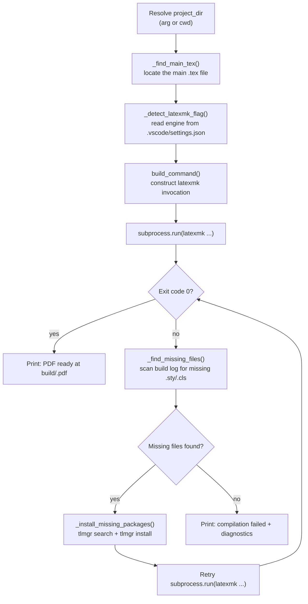

# Build pipeline

`latex-forge build` and `latex-forge watch` are implemented in `build.py`. Both commands delegate to `run_build()`, which resolves the project, constructs the `latexmk` invocation, runs it, and handles failures.

## Step-by-step flow



## Main file detection

`_find_main_tex(project_dir)` applies the following rules in order:

1. If `<folder-name>.tex` exists, use it. This is the standard layout produced by `create`.
2. If exactly one `.tex` file exists at the project root, use it.
3. If multiple `.tex` files exist and none matches the folder name, raise an error with a hint to rename.

## Engine detection

`_detect_latexmk_flag(project_dir)` reads `.vscode/settings.json` and inspects the `args` list of the first LaTeX Workshop tool definition. It looks for the first element that is one of `-lualatex`, `-xelatex`, or `-pdf`. Falls back to `-lualatex` if the file is missing, malformed, or contains no recognised flag.

This means the engine is determined at project creation time (when `latexforge.toml` is read to write `.vscode/settings.json`) and never needs to be specified again at build time.

## The latexmk command

`build_command()` constructs:

```
latexmk
  [-quiet]               # suppressed when --verbose
  [-pvc]                 # added when --watch
  -synctex=1
  -interaction=nonstopmode
  -file-line-error
  -lualatex              # or -xelatex or -pdf
  -outdir=build
  <main>.tex
```

`latexmk` is run with `cwd=project_dir`, so all relative paths in the `.tex` source resolve correctly.

## Missing package auto-install

When `latexmk` exits with a non-zero code, `_find_missing_files()` reads `build/<name>.log` and collects file names that match the pattern `File '<name>.sty' not found` (or `.cls`).

For each missing file:

1. `_tlmgr_package_for_file(filename)` runs `tlmgr search --global --file /<filename>` to find which TeX Live package provides it.
2. If a package is found, `tlmgr install <package>` is run.
3. After all found packages are installed, `latexmk` is retried once.

This mechanism is a no-op on MiKTeX (where `tlmgr` is not available and MiKTeX installs missing packages on demand) and in offline environments.

## Watch mode

`latex-forge watch` adds `-pvc` to the `latexmk` invocation. `latexmk -pvc` keeps a process running that monitors all files included by the `.tex` source and recompiles whenever any of them changes. The process is attached to the terminal; `Ctrl+C` stops it cleanly (the `KeyboardInterrupt` is caught and returns exit code `0`).

Missing package auto-install is skipped in watch mode because `-pvc` never exits and `run_build` would never reach the recovery code.

## Adding support for a new engine

The recognised engine flags are defined in `_ENGINE_FLAGS = ("-lualatex", "-xelatex", "-pdf")` in `build.py`. The default is `_DEFAULT_FLAG = "-lualatex"`. To add a new engine:

1. Add its flag to `_ENGINE_FLAGS`.
2. Add a mapping in `project.py` under `_ENGINE_LATEXMK_FLAG` and `_ENGINE_DISPLAY`.
3. Add it to the `--engine` choices in `cli.py` under `t_install.add_argument("--engine", ...)`.
4. Add it to `_VALID_ENGINES` in `template_manager.py`.
