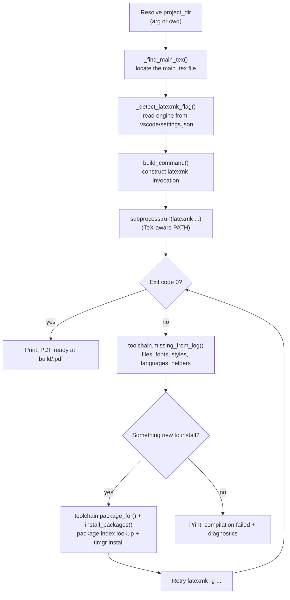

# Build pipeline

`latex-forge build` and `latex-forge watch` are implemented in `build.py`. Both commands delegate to `run_build()`, which resolves the project, constructs the `latexmk` invocation, runs it, and handles failures.

## Step-by-step flow


```mermaid
flowchart TD
    A["Resolve project_dir\n(arg or cwd)"]
    B["_find_main_tex()\nlocate the main .tex file"]
    C["_detect_latexmk_flag()\nread engine from .vscode/settings.json"]
    D["build_command()\nconstruct latexmk invocation"]
    E["subprocess.run(latexmk ...)\n(TeX-aware PATH)"]
    F{Exit code 0?}
    G["Print: PDF ready at build/<name>.pdf"]
    H["toolchain.missing_from_log()\nfiles, fonts, styles, languages, helpers"]
    I{Something new to install?}
    J["toolchain.package_for() + install_packages()\npackage index lookup + tlmgr install"]
    K["Retry latexmk -g ..."]
    L["Print: compilation failed + diagnostics"]

    A --> B --> C --> D --> E --> F
    F -->|yes| G
    F -->|no| H
    H --> I
    I -->|yes| J --> K --> F
    I -->|no| L
```

## Main file detection

`_find_main_tex(project_dir)` applies the following rules in order:

1. If `<folder-name>.tex` exists, use it. This is the standard layout produced by `create`.
2. If exactly one `.tex` file exists at the project root, use it.
3. If multiple `.tex` files exist and none matches the folder name, raise an error with a hint to rename.

## Engine detection

`_detect_latexmk_flag(project_dir)` reads `.vscode/settings.json` and inspects the `args` list of the first LaTeX Workshop tool definition. It looks for the first element that is one of `-lualatex`, `-xelatex`, or `-pdf`. Falls back to `-lualatex` if the file is missing, malformed, or contains no recognised flag.

This means the engine is determined at project creation time (when `latexforge.toml` is read to write `.vscode/settings.json`) and never needs to be specified again at build time.

## The latexmk command

`build_command()` constructs:

```
latexmk
  [-quiet]               # suppressed when --verbose
  [-pvc]                 # added when --watch
  -synctex=1
  -interaction=nonstopmode
  -file-line-error
  -lualatex              # or -xelatex or -pdf
  -outdir=build
  <main>.tex
```

`latexmk` is run with `cwd=project_dir`, so all relative paths in the `.tex` source resolve correctly.

## Finding the TeX tools

`latexmk`, `tlmgr` & co. are resolved with `toolchain.which()`, which searches PATH **plus** the TinyTeX installed by `latex-forge setup` and the usual install locations (`/Library/TeX/texbin`, `/usr/local/texlive/<year>/bin/*`, `C:\texlive\<year>\bin\*`, MiKTeX). latexmk runs with that extended PATH too (`toolchain.tex_env()`). A freshly installed distribution, or MacTeX in an editor started from the Dock, therefore works without restarting anything.

## Missing package auto-install

When `latexmk` exits with a non-zero code on a TeX Live–based distribution, `_install_and_retry()` loops (up to 10 rounds, because LaTeX stops at the first missing file):

1. `toolchain.missing_from_log()` reads `build/<name>.log` and returns what's missing as `(kind, name)` pairs: files (`File 'x.sty' not found`, `.ldf` for babel languages, `.bbx` for biblatex styles, `.tfm` metrics…), OpenType fonts (`The font "X" cannot be found`), hyphenation patterns, and a couple of packages that `pdfx` loads optionally (`colorprofiles`, `luatex85`). `toolchain.missing_helpers()` adds `biber`/`bibtex`/`makeindex` when the build needs them and they're absent.
2. `toolchain.package_for()` maps each one to a TeX Live package using the repository's package database (`texlive.tlpdb`, ≈3 MB, cached for a week in the user cache dir); `tlmgr search --global --file` is the fallback. Font names are matched against font file names.
3. A project's own `latexforge.toml` `tex_packages` list, if any, is installed in the first round.
4. `toolchain.install_packages()` runs one batched `tlmgr install`; names the repository no longer has are dropped and the batch retried, then one-by-one as a last resort.
5. `latexmk -g` recompiles — without `-g`, latexmk would answer "Nothing to do" because the sources didn't change.

The loop stops when nothing new can be installed. With a distribution latex-forge can't modify (a root-owned TeX Live), the `sudo tlmgr install …` command is printed instead. MiKTeX is skipped: it installs missing packages on its own.

## Installing a template's packages up front

`latex-forge create` calls `toolchain.ensure_project_packages()` when the distribution is user-writable (typically the light TinyTeX), so the first compile in VS Code — run by LaTeX Workshop, which calls latexmk directly — doesn't hit a missing package:

1. if the template declares `tex_packages` (built-in templates: `tex_packages.json`; gallery templates: `latexforge.toml`, generated by the gallery's `compute_tex_packages.py`), the missing ones are installed in one `tlmgr install`;
2. otherwise, the packages its sources `\usepackage`/`\documentclass`/`\usetheme` are resolved with `kpsewhich` and installed, then a throwaway compile (into a temporary directory) installs whatever is still reported missing.

In VS Code, the extension also watches `build/*.log` and runs `latex-forge build` when a LaTeX Workshop compile reports a missing package.

## Watch mode

`latex-forge watch` adds `-pvc` to the `latexmk` invocation. `latexmk -pvc` keeps a process running that monitors all files included by the `.tex` source and recompiles whenever any of them changes. The process is attached to the terminal; `Ctrl+C` stops it cleanly (the `KeyboardInterrupt` is caught and returns exit code `0`).

The compile-and-retry loop can't run in watch mode because `-pvc` never exits. Instead, before starting it, `_preinstall_from_sources()` installs the packages the sources load that kpathsea can't find (one `kpsewhich` call).

## Adding support for a new engine

The recognised engine flags are defined in `_ENGINE_FLAGS = ("-lualatex", "-xelatex", "-pdf")` in `build.py`. The default is `_DEFAULT_FLAG = "-lualatex"`. To add a new engine:

1. Add its flag to `_ENGINE_FLAGS`.
2. Add a mapping in `project.py` under `_ENGINE_LATEXMK_FLAG` and `_ENGINE_DISPLAY`.
3. Add it to the `--engine` choices in `cli.py` under `t_install.add_argument("--engine", ...)`.
4. Add it to `_VALID_ENGINES` in `template_manager.py`.
