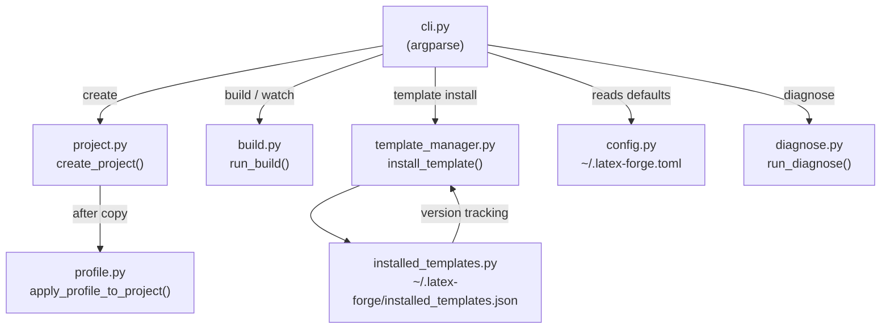

# Architecture overview

## Module map

```
latex_forge/
  cli.py               # Entry point: argparse parser and subcommand dispatcher
  project.py           # Project scaffolding (create, rename, template listing)
  build.py             # latexmk invocation, engine detection, missing-package recovery
  profile.py           # Profile CRUD and injection into .tex files
  config.py            # ~/.latex-forge.toml user preferences
  template_manager.py  # Install, update and remove user-installed templates
  installed_templates.py  # Persistence layer for installed template metadata
  diagnose.py          # Environment checks (TeX Live, latexmk, biber, profile)
  export.py            # ZIP export for submission
  setup.py             # First-run checks and VS Code extension installation
  templates/           # Built-in template files
  styles/packages/     # Local .sty files distributed with the built-in templates
  agents_templates/    # AGENTS.md fragment files assembled at project creation
  getting_started_templates/  # GETTING_STARTED.md fragment files
  scripts_templates/   # Platform-specific setup scripts (setup.sh/bat/py)
  assets/              # Logo and image assets copied into new projects
```

## Data flow



## Key design decisions

### Convention over configuration

The main `.tex` file is always named after its parent folder (`my-report/my-report.tex`). This removes the need for any project-level config file: `build`, `watch`, and `export` simply look for a file whose stem matches the directory name.

### Engine stored in VS Code settings

The LaTeX engine is written into `.vscode/settings.json` at project creation time as part of the LaTeX Workshop recipe. `build.py` reads it back at compile time (`_detect_latexmk_flag`). This means the VS Code extension and the CLI always use the same engine, with no separate config file to keep in sync.

### Profile injection is stateless

Profile values are injected once, at project creation. There is no ongoing link between the profile and the project. Editing the profile later does not change existing projects.

### Regex-based injection with no parser

The profile injection helpers use regular expressions to find and replace `\newcommand{\cmd}{OLD}` patterns in `.tex` files. This avoids the complexity of a LaTeX parser while being precise enough for the well-defined template placeholder format. Any unrecognised command is silently skipped, so injection is always safe.

### LaTeX special character escaping

Profile values are escaped through `_latex_escape()` before being written into `.tex` files. This prevents compilation errors when a name or institution contains LaTeX special characters (`& % $ # _ { } ~ ^ \`). See [Profile injection](profile-injection.md) for details.

### Gallery templates use per-template flat ZIPs

Instead of downloading the entire gallery repository (200 MB+), each gallery template has a pre-built flat ZIP on the `dist` branch of the gallery repository. `template install` tries this fast path first and falls back to a full repository download only if the archive is not available.

### Template versioning via gallery.json

User-installed gallery templates record their version in `~/.latex-forge/installed_templates.json`. `template update` fetches the live `gallery.json` and compares versions. A template is only reinstalled when the gallery has a newer version, avoiding unnecessary downloads.

## File locations

| Path | Purpose |
|---|---|
| `~/.latex-forge/profile.toml` | Personal data (name, email, university, ...) |
| `~/.latex-forge.toml` | CLI defaults (default_template, default_output_dir) |
| `~/.latex-forge/templates/` | User-installed templates |
| `~/.latex-forge/installed_templates.json` | Version and URL metadata for user-installed templates |
