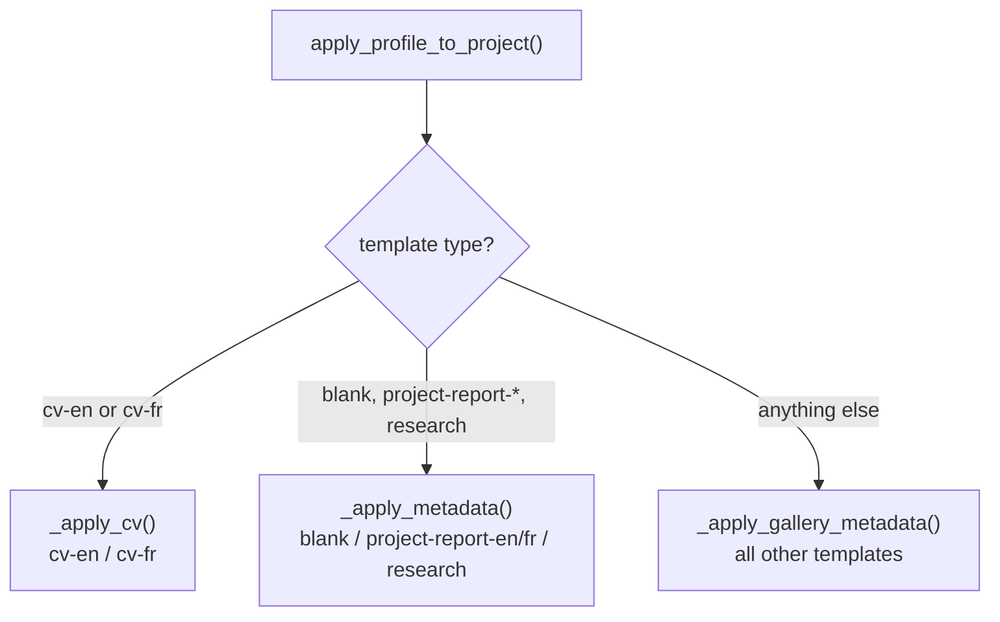

# Profile injection

Profile injection is handled entirely in `profile.py`. The public entry point is `apply_profile_to_project(target_dir, template, profile)`, called by `cli.py` after `create_project()` has assembled the project directory.

## Dispatch by template type



## Built-in CV templates

`_apply_cv()` handles `cv-en` and `cv-fr`. These templates store personal information directly in a section file (`sections/heading.tex` or `sections/en-tete.tex`) using placeholder strings rather than `\newcommand`:

```latex
% heading.tex (before injection)
\name{First LAST}
...
\phone{+1 000.000.0000}
\email{email@example.com}
\href{https://github.com/username}{\texttt{username}}
```

After injection, each placeholder is replaced with the actual value using `str.replace()`. Only the four placeholders that are present in the template are touched; any placeholder whose profile field is unset is left unchanged.

If the CV was installed from the gallery (and therefore has a `frontmatter/metadata.tex` instead of a heading section), the fallback block at the end of `_apply_cv()` handles the gallery-style `\newcommand{\cvname}{...}` layout.

## Built-in report and blank templates

`_apply_metadata()` handles `blank`, `project-report-en`, `project-report-fr`, and `research`. These templates use `\newcommand` and `\addauthor` placeholders in `frontmatter/metadata.tex`.

`blank` uses a simple `\author{Author Name}` macro, replaced via `_replace_cmd()`.

Report and research templates use:
- `\newcommand{\universityname}{Example University}` for the institution
- `\newcommand{\facultyname}{...}` for the programme
- `\addauthor{LASTNAME Firstname}{affiliation}` for each author (French/ISO convention)

## Gallery and installed templates

`_apply_gallery_metadata()` covers everything else, including all templates from the gallery. Because gallery templates follow varied conventions, this function tries every known `\newcommand` variant and skips any that are not present:

| Profile field | Commands tried |
|---|---|
| `first_name` + `last_name` | `\authorname`, `\authorfullname`, `\cvname` (via `\newcommand` and `\renewcommand`) |
| `first_name` | `\cvfirstname` |
| `last_name` | `\cvlastname` |
| `email` | `\authoremail`, `\cvemail`, `\cvmail` |
| `phone` | `\authorphone`, `\cvphone` |
| `github` | `\cvgithub` |
| `linkedin` | `\cvlinkedin` |
| `university` | `\universityname`, `\cvuniversity` |
| `program` | `\facultyname`, `\cvposition` |
| `supervisor` | `\supervisorname`, `\projetEncadrant` (UPC variant) |
| `website` | `\authorwebsite`, `\cvwebsite` |
| `faculty` | `\cvfaculty` |
| `company` | `\cvcompany` |
| `department` | `\cvdepartment` |
| `job_title` | `\cvjobtitle` |

Because every replacement helper is a no-op when the command is not found, this function is always safe to call regardless of which commands a template actually declares.

## Regex helpers

### `_replace_newcmd(content, cmd, value)`

Replaces `\newcommand{\cmd}{OLD}` with `\newcommand{\cmd}{value}`.

```python
pat = re.compile(r"(\\newcommand\{\\" + re.escape(cmd) + r"\}\{)[^}]*(\})")
```

The pattern captures everything before the value and the closing brace separately, then re-inserts them around the new value. This avoids matching nested braces inside the value, but it assumes that template values are single-level (no `{nested}` in the default placeholder), which is always the case.

### `_replace_renewcmd(content, cmd, value)`

Identical to `_replace_newcmd` but targets `\renewcommand`. Used for templates that use `\renewcommand` instead of `\newcommand` (e.g. the twenty-seconds-cv template's `\cvname`).

### `_replace_cmd(content, cmd, value)`

Replaces `\cmd{OLD}` on non-commented lines only (anchored to `^\s*`). Used for `\author{...}` in the blank template.

### `_replace_addauthor(content, placeholder, value)`

Replaces the first occurrence of `\addauthor{PLACEHOLDER}{...}`. Report templates use this command to list co-authors; only the first placeholder is replaced so additional `\addauthor` entries are left for the user to fill.

## LaTeX escaping

All four helpers call `_latex_escape(value)` before performing any substitution:

```python
_LATEX_SPECIALS = {
    "\\": r"\textbackslash{}",
    "&":  r"\&",
    "%":  r"\%",
    "$":  r"\$",
    "#":  r"\#",
    "_":  r"\_",
    "{":  r"\{",
    "}":  r"\}",
    "~":  r"\textasciitilde{}",
    "^":  r"\textasciicircum{}",
}

def _latex_escape(value: str) -> str:
    return "".join(_LATEX_SPECIALS.get(ch, ch) for ch in value)
```

Backslash is escaped first (the dict is ordered and iteration over the string is character-by-character) because `\textbackslash{}` itself contains `{` and `}` that must not be re-escaped.

The GitHub and LinkedIn profile fields are the only values that bypass `_latex_escape`. They are injected verbatim into URL arguments (`\href{https://github.com/...}`) and are guaranteed to contain only URL-safe characters.

## Adding a new profile field

1. Add a row to `PROFILE_SCHEMA` in `profile.py`: `("key", "Display label", "section")`.
2. Add the section name to `SECTION_HEADERS` if it is new.
3. In `_apply_gallery_metadata()`, add the injection call: `content = _replace_newcmd(content, "newcmdname", profile["key"])`.
4. If the field is relevant for the built-in CV or report templates, also update `_apply_cv()` or `_apply_metadata()`.
5. Add a test in `tests/test_profile.py` that verifies the value is replaced and that special characters in the value do not break the substitution.
