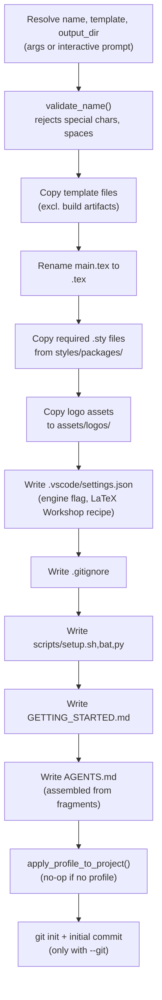

# Project creation

`latex-forge create` is implemented in `cli.py` (argument resolution and interactive prompts) and `project.py` (all file system operations).

## Step-by-step flow



## Name validation

`validate_name()` in `project.py` rejects any name that contains spaces, path separators (`/`, `\`, `:`), or the characters `* ? " < > |`. Names must be non-empty.

## Template file copy

The template directory is walked recursively. Files are excluded if:

- Their suffix is a LaTeX build artifact (`.aux`, `.bbl`, `.bcf`, `.blg`, `.fdb_latexmk`, `.fls`, `.log`, `.out`, `.run.xml`, `.synctex.gz`, `.toc`)
- Their name is `.DS_Store`
- They are inside a `build/` subdirectory

This ensures the built-in templates can have their own compiled example PDF committed without it leaking into generated projects.

## Local style files

Some built-in templates use custom `.sty` files stored in `styles/packages/` (e.g. `report-colors.sty`, `cv.sty`). The function `_copy_style_files()` scans `main.tex` for `\usepackage{...}` and `\RequirePackage{...}` calls, matches them against files in `styles/packages/`, and copies the matched files into `<project>/styles/packages/`. This makes each generated project self-contained.

## VS Code settings

`project.py` writes `.vscode/settings.json` with a LaTeX Workshop recipe tailored to the template's engine:

```json
{
  "latex-workshop.latex.tools": [
    {
      "name": "latexmk",
      "command": "latexmk",
      "args": [
        "-synctex=1",
        "-interaction=nonstopmode",
        "-file-line-error",
        "-lualatex",
        "-outdir=%OUTDIR%",
        "%DOC%"
      ]
    }
  ]
}
```

The engine flag (`-lualatex`, `-xelatex`, `-pdf`) is read from the template's `latexforge.toml`. If no `latexforge.toml` exists, LuaLaTeX is used.

This same flag is later read by `build.py` at compile time (`_detect_latexmk_flag`), keeping the CLI and VS Code in sync without a separate config.

## AGENTS.md assembly

`AGENTS.md` is a briefing file for AI code assistants (Claude, Cursor, Copilot). It is assembled from Markdown fragments stored in `agents_templates/`:

```
agents_templates/
  base.md                  # Always included: project name, build command, rule set
  structure/<family>.md    # File map for this template family
  content/<family>.md      # Writing guidance for this document type
  commands/<family>.md     # LaTeX command reference for this family
  compile/with_bibliography.md   # Bibliography compilation steps (if applicable)
  compile/without_bibliography.md
  writing/academic.md      # Academic writing style guide (research/report families)
  bib_errors.md            # Bibliography troubleshooting tips
```

The `family` is derived from the template name:

| Template | Family |
|---|---|
| `blank` | `blank` |
| `cv-en`, `cv-fr` | `cv-en` or `cv-fr` |
| `research` | `research` |
| `project-report-en`, `project-report-fr` | `report` |
| Any user-installed template | `generic` |

The `generic` family fragments instruct the assistant to inspect the installed template's own `.sty` and `.cls` files for custom commands, instead of making assumptions about what the template provides.

## Profile injection

After the project directory is fully assembled, `apply_profile_to_project()` is called. It reads the saved profile and dispatches to a template-specific injection function. See [Profile injection](profile-injection.md) for a full description of the injection logic.

## Adding a new built-in template

1. Create `latex_forge/templates/<name>/` with `main.tex` and the standard directory layout.
2. Add a description string to `TEMPLATE_DESCRIPTIONS` in `project.py`.
3. If the template needs a non-LuaLaTeX engine, add `latexforge.toml`.
4. If the template uses local `.sty` files, add them to `latex_forge/styles/packages/`.
5. Add a family entry to the `write_agents_md` dispatch table in `project.py` (or use `"generic"`).
6. Include the template name in `package-data` in `pyproject.toml` (it is already covered by `templates/**/*`).
7. Add at least one test in `tests/test_project.py` that calls `create_project` with the new template and verifies key files.
