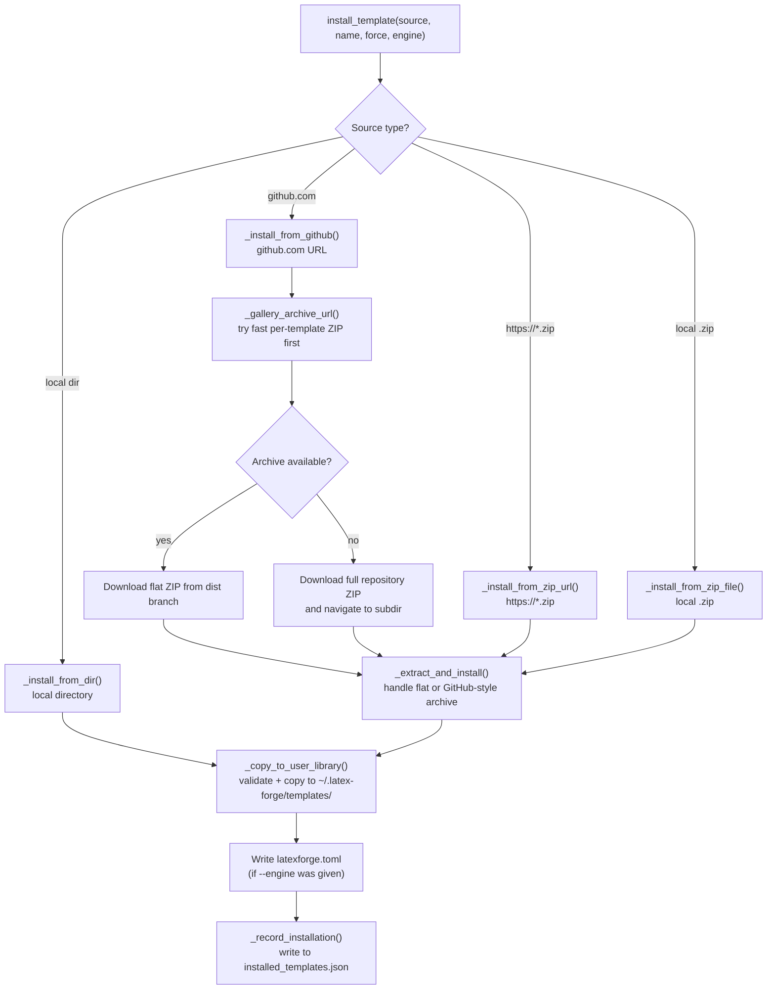

# Template manager

The template manager is in `template_manager.py`. It handles `latex-forge template install`, `update`, `remove`, and the `list` commands that return metadata. Installed template state is persisted by `installed_templates.py`.

## Install flow



## Gallery fast path

When the source URL matches the pattern `github.com/thmsgo18/latex-forge-gallery/tree/main/templates/<category>/<name>`, the manager tries to download a pre-built flat ZIP from:

```
https://raw.githubusercontent.com/thmsgo18/latex-forge-gallery/dist/<name>.zip
```

These archives are produced by the gallery's `build-archives.yml` workflow and contain the template files with `main.tex` at the root, so no navigation into a subdirectory is needed. This avoids downloading the full gallery repository (200 MB+).

If the archive is not found (HTTP error or bad ZIP), the install falls back to downloading the full `HEAD.zip` of the gallery repository and navigating to the template subdirectory.

## Archive extraction

`_extract_and_install()` handles two ZIP layouts:

**Flat ZIP (gallery per-template archives):** `main.tex` is at the extraction root. The extraction directory is used directly.

**GitHub-style ZIP:** Files are wrapped inside a top-level directory named `<repo>-HEAD/`. If `subdir` was extracted from the URL (e.g. `templates/thesis/clean-thesis`), the function navigates to `<repo>-HEAD/<subdir>`. If no `subdir` is given, it uses the top-level directory.

A third case handles single-directory wrapping: if the resolved source directory has no `main.tex` but contains exactly one subdirectory, the function descends one level further.

## Validation

`_copy_to_user_library()` enforces two invariants before copying:

1. **`main.tex` must exist.** A template without `main.tex` cannot be used by `latex-forge create`.
2. **The name must not collide with a built-in template.** Built-in templates live inside the Python package and cannot be overwritten. Use `--name <other-name>` to install under a different name.

Name validation (`_validate_template_name`) rejects path separators, `..`, absolute paths, and names starting with `.` to prevent directory traversal.

## Metadata persistence

After every installation, `_record_installation(name, source)` saves:

```json
{
  "my-template": {
    "install_url": "https://github.com/thmsgo18/latex-forge-gallery/tree/main/templates/thesis/clean-thesis",
    "installed_version": "1.2.0",
    "installed_at": "2024-11-15T10:32:00"
  }
}
```

The version is fetched from `gallery.json` at install time if the source is a gallery URL. For non-gallery sources, `installed_version` is `null`.

The metadata file is `~/.latex-forge/installed_templates.json` and is managed by `installed_templates.py`.

## Update flow

`update_templates(name)` in `template_manager.py`:

1. Loads `installed_templates.json` to get `install_url` and `installed_version` for each user-installed template.
2. Fetches the live `gallery.json` from the gallery repository.
3. For each template whose `install_url` matches the gallery host:
   - Skips if `installed_version == gallery["version"]` (already up to date).
   - Calls `install_template(install_url, name=tname, force=True)` to reinstall.
   - Returns `{"name": ..., "status": "updated", "from": ..., "to": ...}`.
4. Templates installed from non-gallery sources are skipped with status `"skipped"`.

The update check is intentionally simple: it uses string equality on version strings. There is no semantic versioning comparison; the gallery maintainer is responsible for bumping the version whenever the template files change.

## Adding support for a new install source

To add a new source type (e.g. GitLab):

1. Add a detection branch in `install_template()` in `template_manager.py`.
2. Implement `_install_from_gitlab(url, name, force)` that downloads and returns `(template_name, installed_path)`.
3. If versioning should be supported, extend `_record_installation()` to fetch version metadata from the new source.
